##  Here are some Images of this App

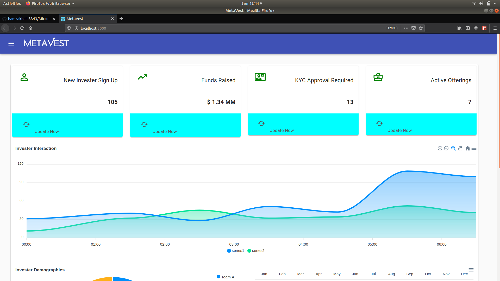
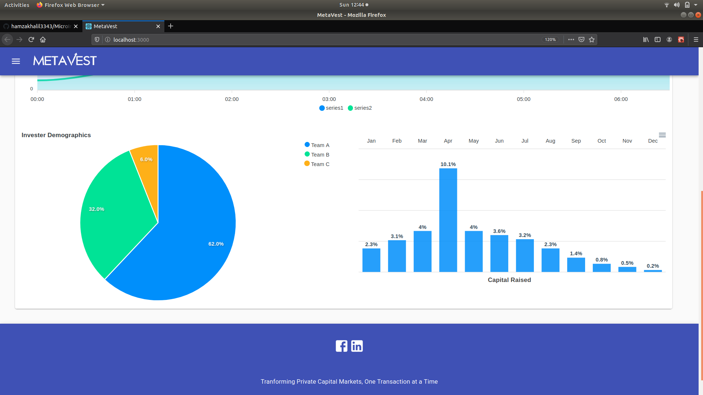
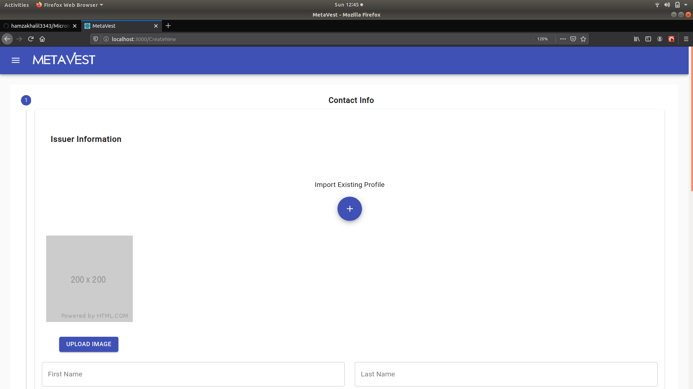
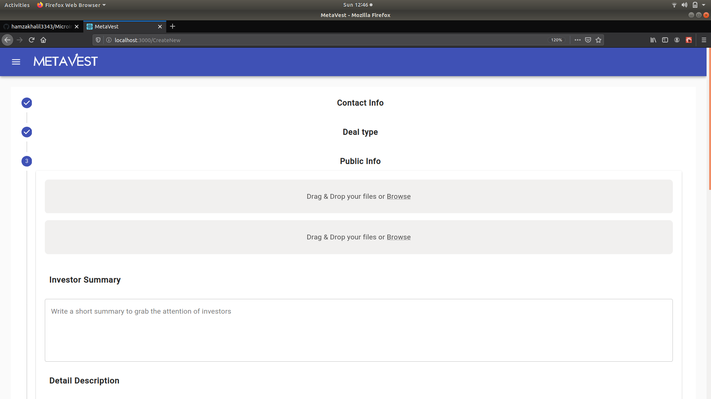
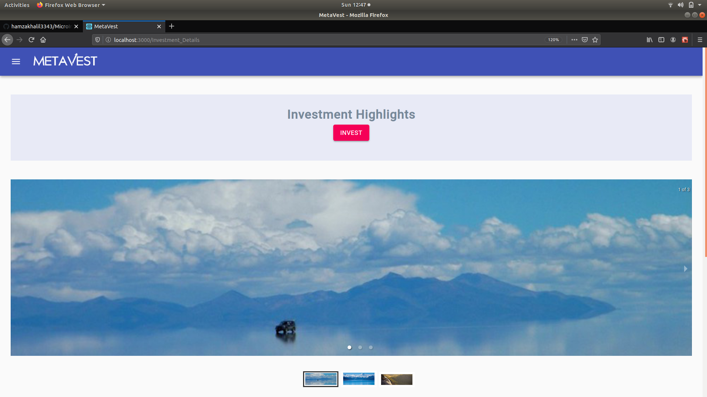
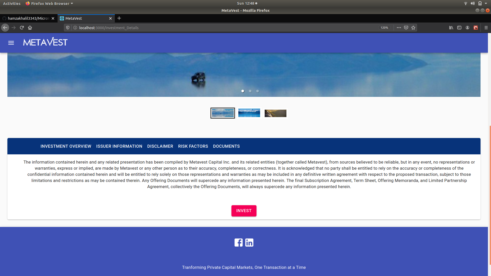
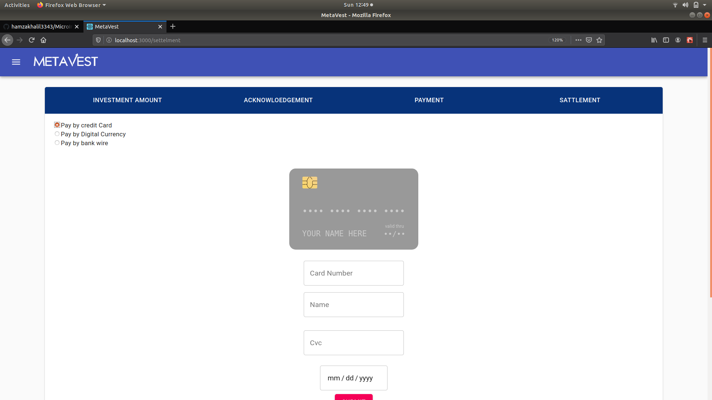

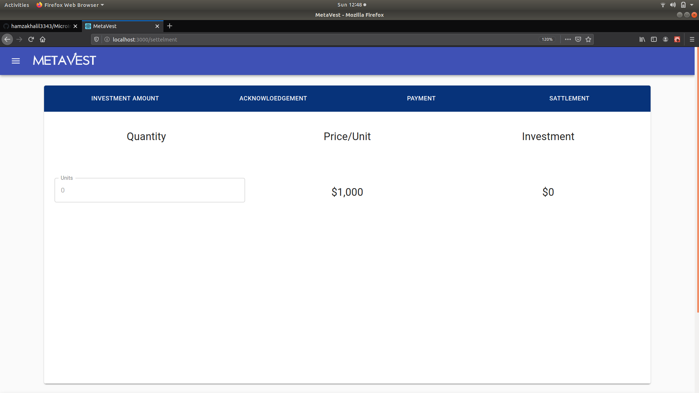
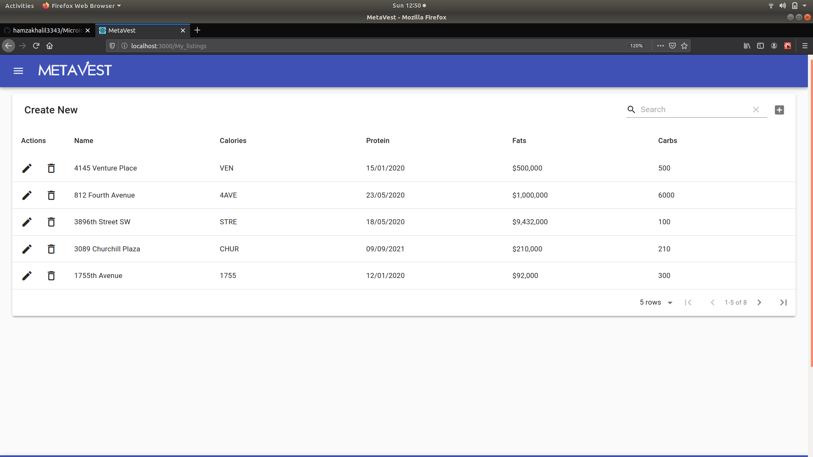
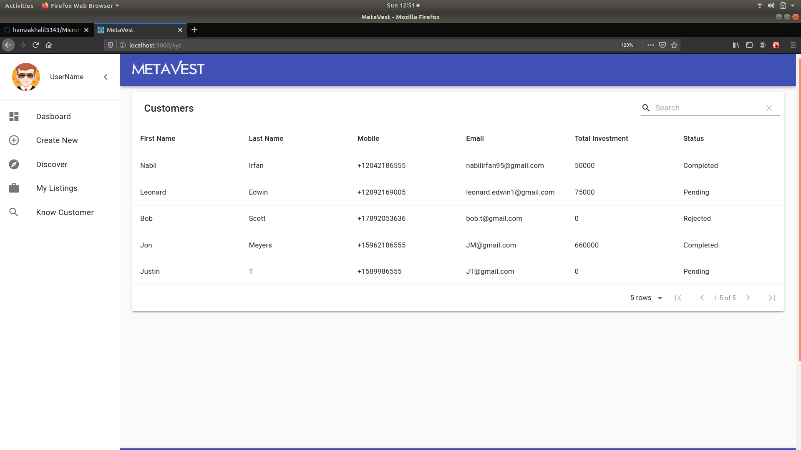
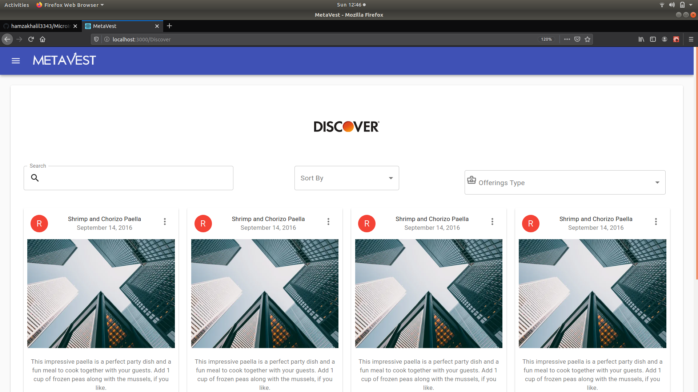
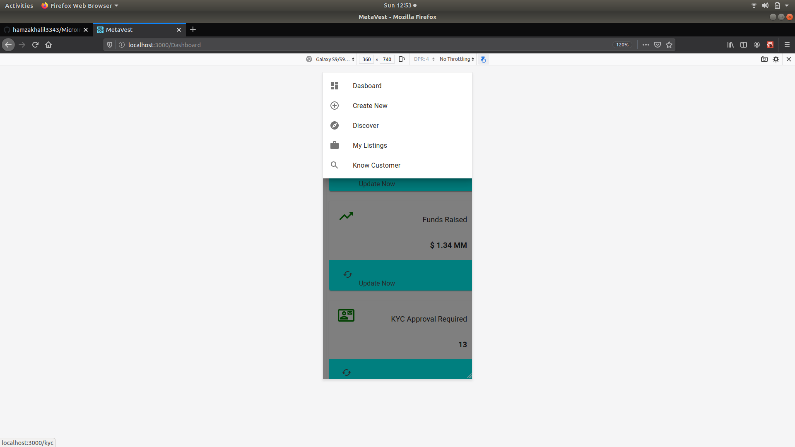

##  How to run

You can clone or download then run :
### `npm i`
### `npm start`

Runs the app in the development mode. 
Open [http://localhost:3000](http://localhost:3000) to view it in the browser.

